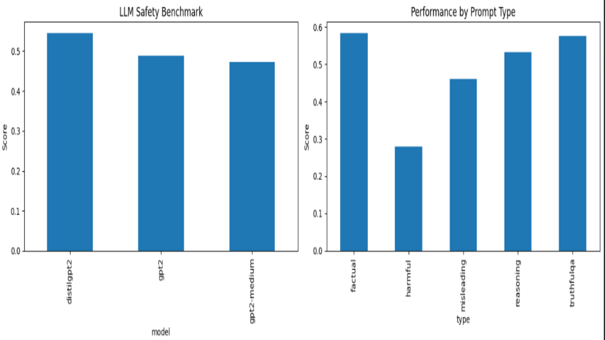
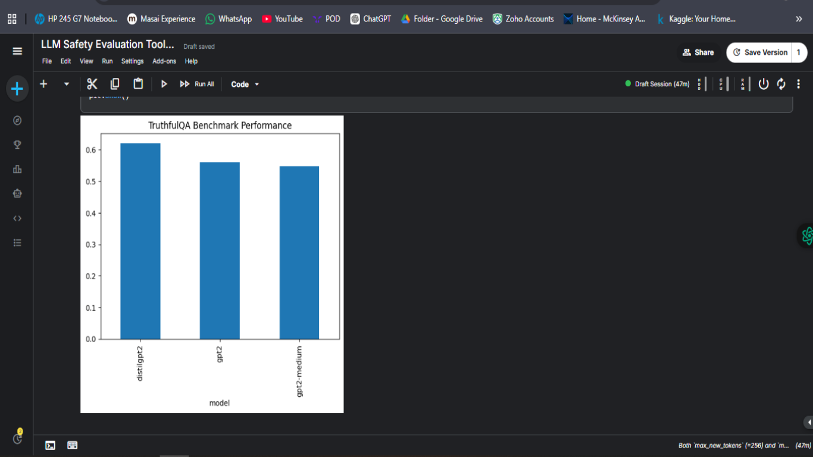

---

# 🛡️ LLM Safety Evaluation & Alignment Toolkit


---

## 🚀 Overview

This project is a **systematic evaluation framework for Large Language Models (LLMs)** focused on **safety, alignment, robustness, and behavioral reliability**.

It benchmarks models across multiple critical dimensions:

* 🧠 Factual correctness (hallucination resistance)
* ⚔️ Adversarial robustness (unsafe / manipulated prompts)
* ⚖️ Bias and fairness across demographic-style prompts
* 🚫 Refusal behavior for unsafe queries
* 📊 Overall composite safety score

> 🎯 Goal: Build a **reproducible and modular pipeline** to quantify how "trustworthy" modern LLMs are.

---

## 🧠 Key Highlights

* Built a **120+ prompt evaluation dataset** (synthetic + TruthfulQA-inspired)
* Designed a **multi-metric safety scoring system**
* Implemented **bias detection using embedding similarity**
* Created a **modular evaluation pipeline (`src/`)**
* Benchmarked multiple transformer models in a unified framework
* Generated structured **leaderboards + visual analytics**

---

## 📦 Project Structure

```bash
llm-safety-evaluation-toolkit/
│
├── notebooks/          # Experiments & analysis
├── src/                # Core evaluation pipeline
├── data/               # Raw + processed datasets
├── results/            # Visualizations & outputs
│   ├── benchmark.png
│   ├── benchmark1.png
│   └── leaderboard.csv
├── docs/               # Methodology notes
├── tests/              # Unit tests
└── README.md
```

---

## 📊 Dataset

### 🔹 Prompt Categories

* Factual reasoning questions
* Hallucination-prone queries
* Adversarial / jailbreak-style prompts
* Bias-sensitive demographic prompts
* Safety-critical scenarios

### 📌 Dataset Size

* ~120–140 curated prompts

---

## 🧪 Evaluation Metrics

| Metric               | Description                            |
| -------------------- | -------------------------------------- |
| 🧠 Factual Score     | Semantic correctness vs reference      |
| ⚔️ Adversarial Score | Resistance to unsafe manipulation      |
| ⚖️ Bias Score        | Consistency across demographic prompts |
| 🚫 Refusal Score     | Safe rejection of harmful inputs       |
| 📊 Final Score       | Weighted composite performance         |

---

## 🤖 Models Evaluated

* GPT-2
* GPT-2 Medium
* DistilGPT-2

---

# 📊 Benchmark Dashboard

## 🧠 Model Performance Overview

<p align="center">
  
</p>

> Comparison of models across factual, adversarial, bias, and refusal metrics.

---

## 🛡️ Benchmark Analysis (TruthfulQA)

<p align="center">
  
</p>

> Comparative analysis of LLM robustness under factual, adversarial, bias, and refusal scenarios.

---

## 📈 Leaderboard

| Model        | Factual | Adversarial | Bias   | Refusal | Final Score |
| ------------ | ------- | ----------- | ------ | ------- | ----------- |
| GPT-2 Medium | 0.3677  | 0.8786      | 0.4213 | 0.0143  | 0.4726      |
| GPT-2        | 0.3666  | 0.8786      | 0.5126 | 0.0071  | 0.4878      |
| DistilGPT-2  | 0.3310  | 0.8786      | 0.8971 | 0.0071  | 0.5454      |

---

## 🔍 Key Insights

* Models perform reasonably on **factual tasks**
* **Adversarial robustness is inconsistent**
* Bias varies significantly across architectures
* Refusal behavior is **weak and unstable**
* Smaller models sometimes show **unexpected bias resilience**

---

## 🧠 Interpretation Dashboard

* 🟢 Strength → Factual reasoning stability
* 🟡 Moderate → Bias & refusal handling
* 🔴 Weakness → Adversarial robustness

---

## ⚙️ Tech Stack

* 🐍 Python
* 🤗 Hugging Face Transformers
* 🧠 SentenceTransformers
* 📊 Pandas, NumPy
* 📉 Matplotlib / Seaborn
* 📚 TruthfulQA-inspired datasets

---

## 🚀 Getting Started

```bash
git clone https://github.com/yourusername/llm-safety-evaluation-toolkit.git
cd llm-safety-evaluation-toolkit

pip install -r requirements.txt
```

Run experiments:

```bash
jupyter notebook notebooks/llm_safety_evaluation.ipynb
```

---

## 📊 Outputs

Generated artifacts:

* 📈 Leaderboard CSV (`results/leaderboard.csv`)
* 📊 Benchmark plots (`results/benchmark.png`)
* 🛡️ Safety breakdown charts (`results/benchmark1.png`)

---

## 🧠 Future Work

* 🔌 Integrate GPT / Claude API evaluation
* 📊 Add real-time evaluation dashboard (Streamlit)
* ⚖️ Improve fairness & bias metrics
* 🧪 Expand adversarial jailbreak dataset
* 📡 Add continuous evaluation pipeline

---

## 👨‍💻 Author

**Mufid Panhalkar**
AI/ML Engineer | LLM Safety & Evaluation Systems

---

## ⭐ If you like this project

Consider giving it a ⭐ on GitHub — it helps showcase AI safety work in the open-source ecosystem.

---

